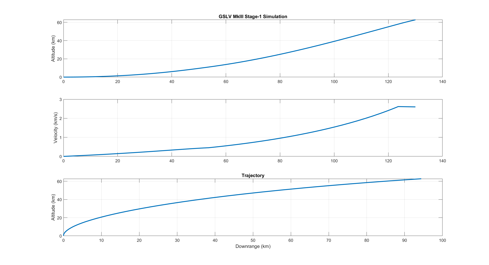
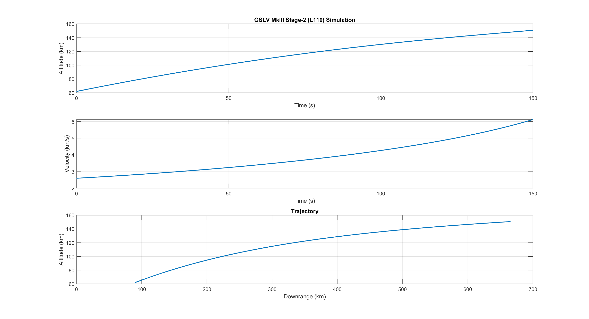
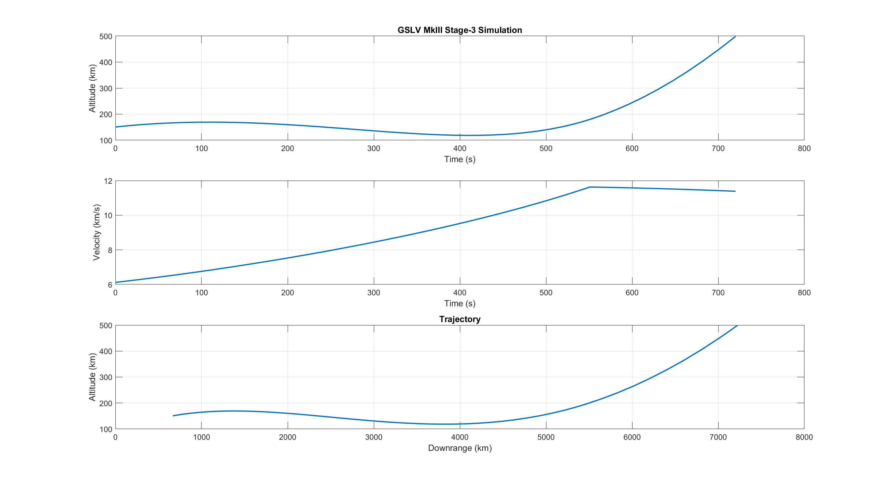

# 🚀 GSLV MkIII Launch Simulation  

This repository contains a **MATLAB-based simulation of GSLV MkIII (Geosynchronous Satellite Launch Vehicle – Mark III)**, India’s heaviest rocket developed by **ISRO**.  
The project models the **three main stages of launch**, from liftoff to final orbital injection, using simplified physics-based equations of motion.  

---

## 📌 Project Overview  

- **Stage 1 – S200 Boosters**  
  Simulates liftoff using twin solid rocket boosters, including thrust, drag, gravity effects, and gravity turn initiation.  

- **Stage 2 – L110 Liquid Core (Vikas Engines)**  
  Models ascent after booster separation with twin Vikas engines, considering drag, gravity losses, and mass depletion.  

- **Stage 3 – CE-20 Cryogenic Upper Stage**  
  Simulates orbital injection using cryogenic propulsion, including cutoff conditions (target velocity & altitude) and a simple pitch program.  

Each stage outputs **altitude, velocity, downrange trajectory, and final stage conditions**, with plots for visualization.  

---

## 🔧 Features  

- Stage-wise modular MATLAB scripts.  
- Simplified **atmosphere (ISA + exponential)** and **gravity models**.  
- Plots for:  
  - Altitude vs. Time  
  - Velocity vs. Time  
  - Trajectory (Downrange vs. Altitude)  
- Final stage outputs: altitude, velocity, flight angle, and mass.  

---

## 📊 Example Outputs  

Each stage produces plots like:  

-
-
-

## 📚 Applications  

This project is useful for:  

- Understanding **multi-stage rocket dynamics**.  
- Studying the **effects of thrust, drag, and gravity** on launch trajectories.  
- Providing a **starting point for trajectory optimization research**.  

## 🚀 Future Work  

- Adding **staging animations** for better visualization.  
- Extending to **full orbital propagation** (e.g., GTO insertion).  
- Implementing **real ISRO launch data comparisons**.  
- Expanding to simulate **other launch vehicles**.  

## 📜 License  

This project is licensed under the **MIT License** – you are free to use, modify, and distribute it with attribution.  

## 🌌 Acknowledgments  

- **ISRO** for inspiring this project through the GSLV MkIII missions.  
- Open-source aerospace and orbital mechanics communities.  

